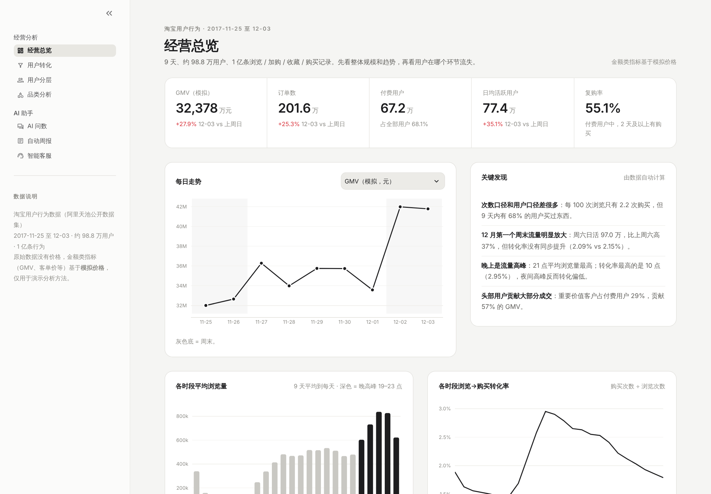
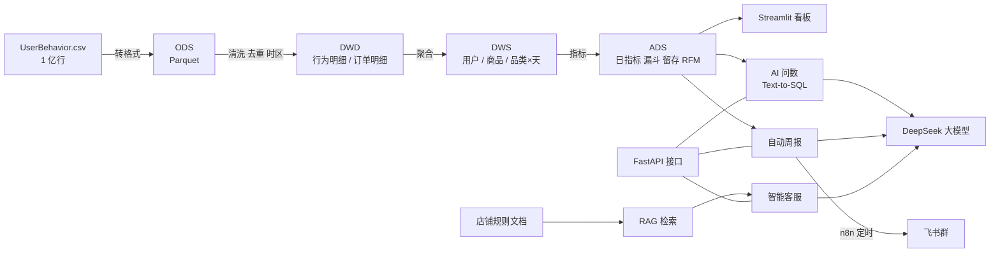

# 电商 AI 运营助手

> 基于 **1 亿条淘宝用户行为数据**，从数据清洗、数仓分层、经营分析看板，到 **AI 问数、自动周报、智能客服** 的完整项目。
> 目标：用数据回答“用户在哪里流失、谁是核心用户、哪些品类值得优化”，再用大模型把查数、写报告、答客服这些重复工作自动化。



## 项目亮点

| 模块 | 做了什么 | 关键结果 |
|---|---|---|
| 数据仓库 | 3.5GB CSV → ODS / DWD / DWS / ADS 四层，16 项数据质量自动检查 | 1 亿行全量构建约 30 秒；剔除脏数据 0.06% |
| 经营分析看板 | 经营总览、用户漏斗、RFM 分层、品类四象限，共 4 页 | 发现“9 天内 61% 的浏览用户完成购买，但每 100 次浏览只有 2.2 次购买”等结论 |
| AI 问数 | 中文提问 → 大模型写 SQL → 只读执行 → 报错自动修正 → 中文结论 | 23 道标准题离线评测，见 [评测报告](reports/text2sql_eval.md) |
| 自动周报 | SQL 算数 + 大模型写分析 + **数字自动核对** + 飞书推送，n8n 每周定时触发 | 模型编造的数字会被拦截并提醒人工审核 |
| 智能客服 | 店铺规则文档 RAG 问答（标注来源、查不到转人工）+ 工单 8 分类 | 检索 Hit@3 100%，拒答判断 100%（23 题），见 [评测报告](reports/service_eval.md) |

## 系统架构



## 技术栈

- **数据**：DuckDB（列式分析数据库）、SQL（窗口函数、CTE、FILTER 聚合）、Parquet、pandas
- **可视化**：Streamlit、Plotly
- **AI**：DeepSeek（OpenAI 兼容接口）、Text-to-SQL、RAG（BM25 / 可选向量混合检索 + RRF 融合）、结构化输出（JSON）
- **自动化**：FastAPI、n8n、飞书机器人
- **工程**：Git、数据质量检查、离线评测集

## 数据说明

- 来源：[阿里天池 · 淘宝用户购物行为数据集](https://tianchi.aliyun.com/dataset/649)，2017-11-25 至 12-03，约 98.8 万用户、1 亿条行为（浏览、加购、收藏、购买）。
- **原始数据没有价格**。为了演示完整的指标体系，项目给每个商品生成了可复现的**模拟价格**（规则见 `sql/02_dim_item.sql`），所有金额类指标仅用于演示分析方法。
- 智能客服的知识库和 60 条工单是为演示编写的**虚构店铺规则和模拟工单**。

## 快速开始（Mac）

1. 下载数据集，把 `UserBehavior.csv` 放到 `data/raw/`
2. 双击 `安装.command`（创建虚拟环境、安装依赖、构建数据仓库）
3. 打开项目根目录的 `.env`，填写 `DEEPSEEK_API_KEY`（不填也能看分析看板，AI 页面为演示模式）
4. 双击 `启动看板.command`，浏览器打开 http://localhost:8502

命令行方式：

```bash
python -m venv .venv && source .venv/bin/activate
pip install -r requirements.txt
python pipeline/build_warehouse.py          # 构建数据仓库 + 质量检查
streamlit run app/app.py                    # 看板
python eval/run_text2sql_eval.py            # AI 问数评测
python eval/run_service_eval.py --llm       # 智能客服评测
python ai/weekly_report.py --push           # 生成周报并推送飞书
uvicorn api.server:app --port 8000          # 接口（给 n8n / Dify 调用）
```

## 目录结构

```
├── pipeline/            数据流水线：构建数仓、质量检查
├── sql/                 分层建表 SQL（01 DWD → 05 ADS）
├── app/                 Streamlit 看板（views/ 下每个文件一页）
├── ai/                  AI 能力：llm 调用、text2sql、weekly_report、rag、tickets
├── api/                 FastAPI 接口
├── kb/                  客服知识库文档 + 模拟工单
├── eval/                评测集与评测脚本
├── workflows/           n8n 工作流（可直接导入）
├── reports/             数据质量、评测报告、周报样例
└── docs/                分析报告、学习地图、面试题、Dify 搭建说明
```

## 主要分析结论

详见 [分析报告](docs/analysis_report.md)。

1. **转化口径差异巨大**：次数口径浏览→购买只有 2.2%，用户口径 61% 的浏览用户 9 天内完成购买。看“流量效率”和看“用户最终是否购买”要用不同口径。
2. **加购是最关键的购买前动作**：79% 的购买用户加购过商品，“加购未购买”人群是最直接的转化抓手。
3. **头部用户贡献大部分成交**：重要价值客户占付费用户 28.7%，贡献 56.9% 的 GMV。
4. **12 月第一个周末流量放大 36%，但转化率没有同步提升**；留存数据在这两天出现异常跳升，判断为数据集抽样或大促预热造成，分析时予以剔除。
5. **品类长尾明显**：9437 个品类中，527 个（5.6%）贡献了 80% 的 GMV；四象限找出“高流量低转化”的机会品类。

## 局限与改进方向

- 数据只有 9 天，无法分析月度趋势、长期留存和季节性；RFM 只能用简化的高/低两档。
- 价格为模拟，金额类结论只代表方法。
- AI 问数依赖语义层说明，遇到复杂多表问题仍可能出错；下一步可以加入“相似问题 + SQL 示例”检索（few-shot）提高准确率。
- 智能客服的同义词表和规则分类基线是在评测集上调的，结果偏乐观；需要更多真实工单做独立测试集。
